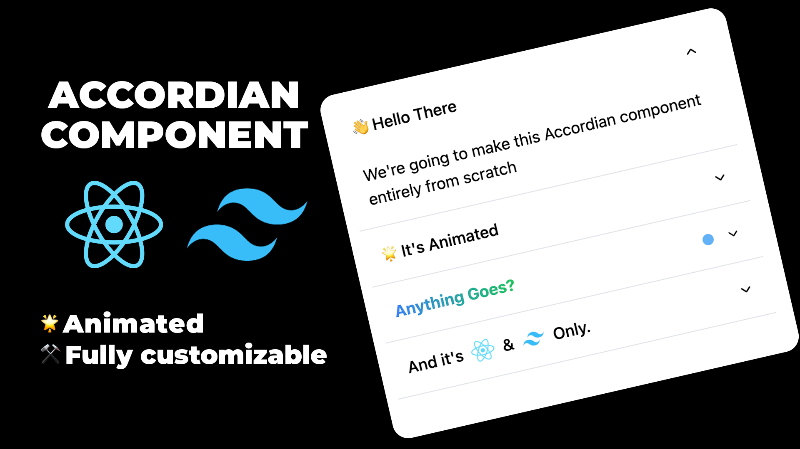

# Animated Accordion Component in ReactJS and Tailwind CSS

The Animated Accordion Component, expertly crafted with ReactJS and Tailwind CSS, brings a dynamic and interactive element to web applications. This component serves as a detailed guide on creating an accordion-style UI that gracefully expands and collapses content sections with smooth animations. Tailwind CSS streamlines styling with utility-first classes, while React's component-based structure ensures seamless integration and customization. Developers can follow this tutorial to implement an Animated Accordion that not only optimizes space but also enhances user experience by revealing content in an engaging and visually appealing manner.

